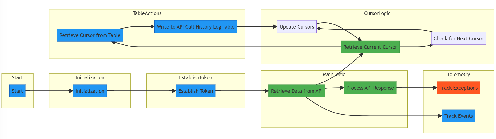
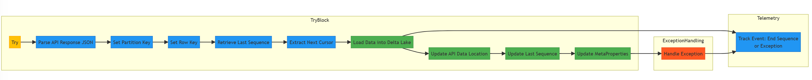

# Ingestion Notebook Walkthrough

## Overview

The purpose of the Ingestion Notebook is to pull data from the WFS APIs, flatten the data & finally produce an output for transformation to consume.

## Structure

<pre>
- ingestion
  - logics
    - ingestion_logic.ipynb
  - runners
    - ingestion_runner.ipynb
  - utilities
    - flattened_nested.ipynb
    - generate_auth_token.ipynb
    - process_api_response.ipynb
    - table_storage_actions.ipynb
</pre>

## Architecture

The ingestion layer relies on a series of IPython notebooks, formerly known as Jupyter notebooks, to successfully execute. This structure applies to all of our layers: ingestion, transformation & publishing.

- ingestion_runner
  - The purpose of this notebook is to construct any dependencies that the logic will need to execute as well as executing the logic.execute().
  - Any libraries or classes specific to this layer will be imported / constructed in this notebook.
- ingestion_logic
  - The purpose of this notebook is to perform the necessary steps to ingest the WFS API data & produce updated Parquet files for the transformation layer to consume.
- helpers
  - A series of notebooks leveraged by the logic to successfully pull, flatten & produce desired parquet outputs.

## Ingestion Logic Walkthrough

- ingestion_logic steps:
  - Pull data from WFS API; API information is retrieved from the [ApiMetaData table](..\storage_tables\api_meta_data.md).
  - Validate data; validations are executed via the [validation_engine notebook](helper_notebooks\validation_engine_notebook.md).
  - Flatten data; data from WFS comes formatted in a nested json.
  - Create a new ingestion Parquet file and update the  [ApiDataLocation table](..\storage_tables\api_data_location.md) with the latest locations.

## Ingestion Code Walkthrogh

### ApiDataRetriever Class

The `ApiDataRetriever` class is responsible for retrieving data from an API, processing it, and managing various aspects of the process.



### Constructor

The `ApiDataRetriever` class constructor takes the following parameters:

- `params` (str): A dictionary containing parameters for API configuration.
- `table_actions`: Table actions object.
- `telemetry_client`: Telemetry client for tracking events.

### Methods

#### `__init__(self, params: str, table_actions, telemetry_client: TelemetryClient)`

Initializes the `ApiDataRetriever` instance.

#### `retrieve_data_from_api(self)`

Retrieves data from an API and writes it to an Azure Table.

### Flow Diagram Steps

The following steps describe the flow of the `ApiDataRetriever` class:

1. **Start (A)**: The process begins.

2. **Initialization (B)**: Initialization steps are performed, including setting up parameters.

3. **Establish Token (C)**: The token for API authentication is established.

4. **Retrieve Data from API (D)**: Data is retrieved from the API using the established token.

5. **Retrieve Current Cursor (F)**: The current cursor for data retrieval is retrieved.

6. **Check for Next Cursor (G)**: Checks if there is a next cursor for more data.

7. **Update Cursors (H)**: Updates the cursors for the next data retrieval.

8. **Track Events (I)**: Telemetry tracking records events during the process.

9. **Process API Response (E)**: The API response data is processed.

    - **Parse API Response JSON (A)**: The JSON response text is parsed to convert it into a Python dictionary (`api_response`).
    - **Set Partition Key (B)**: The partition key is set to the `api_name`, which is used for data organization.
    - **Set Row Key (C)**: The row key is also set to the `api_name`, which uniquely identifies the data.
    - **Retrieve Last Sequence (D)**: The last sequence number is retrieved from the metadata table. This number indicates the order of data processing.
    - **Extract Next Cursor (E)**: The next cursor, which is part of the API response, is extracted. It helps in fetching the next set of data.
    - **Load Data into Delta Lake (F)**: The API response data is processed and loaded into Delta Lake. This involves several sub-steps, such as creating an RDD, converting it into a DataFrame, and adding necessary columns.
    - **Update API Data Location (G)**: The location of the processed data is updated, indicating that it is available for use.
    - **Update Last Sequence (I)**: The last sequence number is updated to reflect the completion of data processing.
    - **Update MetaProperties (J)**: MetaProperties, including the next cursor and bronze index, are updated to manage the data retrieval process.
    - **Track Event: End Sequence (K)**: A telemetry event is tracked to record the end sequence number after data processing.
    - **Exception Handling (L)**: If an exception occurs during the process, it is handled. Exception handling includes tracking the exception.


10. **Track Exceptions (J)**: Telemetry tracking records exceptions, if any.

11. **Retrieve Cursor from Table (K)**: Retrieves the cursor from a table for future reference.

12. **Write to API Call History Log Table (L)**: Writes information to the API Call History Log table.

### Usage

```python
# Create an instance of ApiDataRetriever
api_retriever = ApiDataRetriever(params, table_actions, telemetry_client)

# Retrieve and process data from the API
api_retriever.retrieve_data_from_api()
