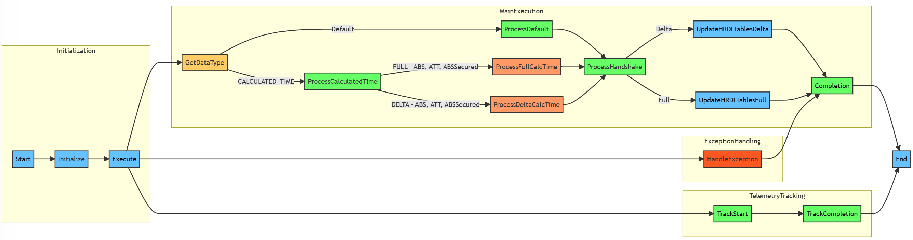

# Publishing Notebook

## Overview

The purpose of the Publishing Notebook is to finalize transformed data from the WFS APIs, create a handshake file containing the timestamp of the latest dataset & produce Parquet files for the Synapse ADF Pipeline to copy over to the HRDL Datastore. 

## Structure

<pre>
- publishing
  - logics
    - publishing_logic.ipynb
  - runners
    - publishing_runner.ipynb
</pre>

## Architecture

The publishing layer relies on a series of IPython notebooks, formerly known as Jupyter notebooks, to successfully execute this layer of our process. This structure applies to all of our layers: ingestion, transformation & publishing.

- publishing_runner
  - The purpose of this notebook is to construct any dependencies that the logic will need to execute as well as executing the logic.execute().
  - Any libraries or classes specific to this layer will be imported / constructed in this notebook.
- publishing_logic
  - The purpose of this notebook is to perform the necessary steps to finalize the transformed data & produce updated Parquet file with user-defined schemas as well as the handshake file.

## Publishing Logic Walkthrough

- publishing_logic steps:
  - Pull data from transformed layer; location of latest transformed Parquet file is found in the [ApiDataLocation table](..\storage_tables\api_data_location.md). 
  - Validate transformed data; validations are executed via the [validation_engine notebook](helper_notebooks\validation_engine_notebook.md).
  - Update the schema to the finalized user-defined version.
  - Create a new publishing Parquet file with the update schema for the Synapse ADF Pipeline to copy over to the HRDL store
  - Create a handshake file with 1 row / column pointing to the latest generated published file; the value in this file is the timestamp at which the file was created.  

## Publishing Code Walkthrough

The publishing logic is represented by the following flowchart:




Here is the representation of the workflow of the `PublishingLogicEngine` class, outlining the various steps involved in its execution.


## FlowChart Overview

- The main execution of the class starts.
- It proceeds to determine the data type for publishing.
- If the data type is `CALCULATED_TIME`, the following steps are executed:
  - Processing for calculated times, including ABS, ATT, and ABSSecured.
  - Separate processes for Full and Delta formats.
- If the data type is `Default`, a default processing path is followed.
- Handshake processing occurs, and it proceeds to update HRDL tables for both Delta and Full formats.
- Exception handling is included to address any errors that may occur during execution.
- Telemetry tracking records the start and completion of the process.

## Class Overview

1. **Initialization**

   - The class is initialized with various dependencies.
   - Parameters such as data type, run ID, and execution time are set.

    ```python
    def __init__(self, spark_session, data_configs_helper, datalake_client, validation_engine, table_client, api_data_location_table, telemetry_client, ms_spark_utils, params):
        self.spark_session = spark_session; self.data_configs_helper = data_configs_helper
    ```

2. **Execute**

   - The main execution method of the class.
   - Begins the publishing logic for the specified data type and codes.

    ```python
    def execute(self): self.get_codes(self.data_type)
    ```

3. **Get Codes**

   - Determines the list of codes based on the data type.

    ```python
    def get_codes(self, data_type): return ["ATT", "ABS", PublishingLogicEngine.ABS_SECURED_CODE] if data_type == PublishingLogicEngine.CALCULATED_TIME else ["Default"]
    ```

4. **Track Event**

   - Tracks the event of the publishing logic for telemetry purposes.
Example:

    ```python
    def track_event(self, data_type, code): self.telemetry_client.track_event(f"Starting {data_type} publishing logic for run id {self.run_id} on {self.run_execution_time}.")
    ```

5. **Process Full File Format**

   - Processes the full file format for each code.
   - Reads transformed data from the silver location.
   - Validates data schema.
   - Prepares finalized dataframe.
   - Publishes data as Full.
   - Updates HRDL tables for Full format.

6. **Process Delta File Format**

   - Processes the delta file format for each code.
   - Reads transformed data from the silver location.
   - Validates data schema.
   - Prepares finalized dataframe.
   - Publishes data as Delta.
   - Updates HRDL tables for Delta format.

    ```python
    def process_publishing_file_format(self, file_format, code): api_data_location_entity_silver = ApiDataLocationEntity.from_dict(self.table_client.get_table_entity_row(self.api_data_location_table, self.data_type, silver_row_key))
    ```

7. **Update HRDL Tables (Full/Delta)**

   - Updates HRDL publishing tables, including file paths and status.

    ```python
    def update_hrdl_tables(self, code, data_path, file_format, handshake_path): hrdl_file_pub_entity = HrdlPublishJobEntity.from_dict(self.table_client.get_table_entity_row("HRDLFilePublishDetails", hrdl_entity_name, file_format))
    ```

8. **Exception Handling**

   - Handles any exceptions that occur during the execution.
   - Logs exceptions and re-raises them.

    ```python
    def execute(self):
        try: codes = self.get_codes(self.data_type)
        except Exception as e: self.telemetry_client.track_exception(e); raise e
    ```
