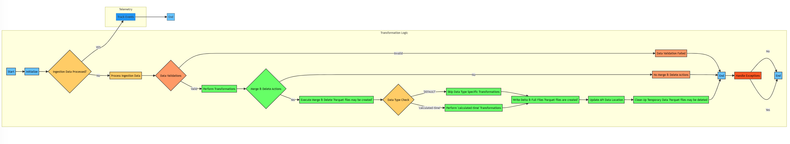
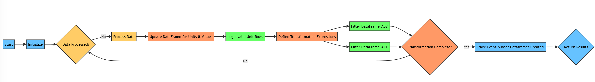
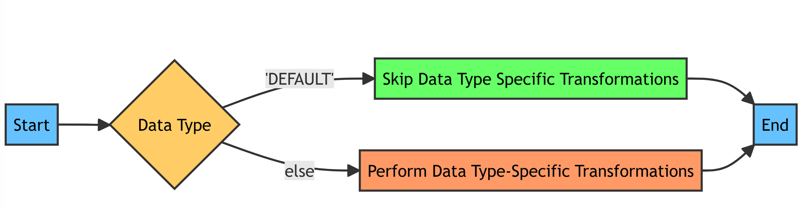

# Transformation Notebook

## Overview

The purpose of the Transformation Notebook is to transform ingested data from the WFS APIs, validate the data, perform any data transformations & finally produce an output for publishing to consume.

## Structure

<pre>
- transformation
  - logics
    - transformation_logic.ipynb
  - runners
    - transformation_runner.ipynb
  - utilities
    - transformation_helper.ipynb
</pre>

## Architecture

The transformation layer relies on a series of IPython notebooks, formerly known as Jupyter notebooks, to successfully execute this layer of our process. This structure applies to all of our layers: ingestion, transformation & publishing.

- transformation_runner
  - The purpose of this notebook is to construct any dependencies that the logic will need to execute as well as executing the logic.execute().
  - Any libraries or classes specific to this layer will be imported / constructed in this notebook.
- transformation_logic
  - The purpose of this notebook is to perform the necessary steps to transform the ingested data & produce updated Parquet files with the latest merges / deletes from the ingested data.
- transformation_helper
  - The purpose of this notebook is to contain supporting methods for the logic to perform the transformations.

## Transformation Logic Walkthrough


- transformation_logic steps:
  - Pull data from ingested layer; location of latest ingested Parquet file is found in the [ApiDataLocation table](..\storage_tables\api_data_location.md).
  - Validate ingested data; validations are executed via the [validation_engine notebook](helper_notebooks\validation_engine_notebook.md).
  - Perform merges / delete updates on the existing Published Parquet file found in the [ApiDataLocation table](..\storage_tables\api_data_location.md).
  - Create a new transformed Parquet file with the latest merge / delete updates for Publishing layer to consume; creates both FULL and DELTA files.
    - FULL being the complete data set including latest merges / deletes.
    - DELTA being only the latest merges / deletes in the current ingested data.

## Transformation Code Walkthrough

### Transformation Logic Flowchart

The transformation logic is represented by the following flowchart:



The flowchart describes the following steps:

1. **Start:** The process begins here.

2. **Initialize:** Initialization and setup steps are performed.

3. **Ingestion Data Processed?:** Checks if the ingestion data has been processed.

4. **Process Ingestion Data:** If data is not processed, this step processes the ingestion data.

     ```python linenums
      if (ingestion_api_data_location_entity.is_processed == False):
      ```

5. **Data Validations:** Data validations are performed to ensure data integrity.

   - If the data is valid, the process proceeds to Perform Transformations.
   - If the data is invalid, it goes to Data Validation Failed.

6. **Perform Transformations:** Various transformations are applied to the data.

7. **Merge & Delete Actions:** Checks for merge and delete actions.

   - If merge and delete actions are present, it executes Merge & Delete.
   - If no merge and delete actions are found, it goes to No Merge & Delete Actions.

        ```python linenums
        if ingested_deletes_df.count() > 0 or ingested_merges_df.count() > 0:
        ```

8. **Data Type Check:** Checks the data type.

   - If the data type is 'calculated-time,' it goes to Perform 'calculated-time' Transformations.

        ```python linenums
        if self.data_type == 'calculated-time':
            transforms = self.transformation_helper.perform_calculated_time_transformations(processed_full_df)
        ```

     

   - If the data type is 'DEFAULT,' it skips data type-specific transformations and goes to Skip Data Type Specific Transformations.

     

9. **Write Delta & Full Files:** Writes Delta and Full files.

    ```python linenums
    self.datalake_client.write_generic_format(indexed_df, f"{root_temp_location}/indexed_df/{self.data_type}_{df_type}/{self.run_execution_time}", "parquet", "overwrite")
    ```

10. **Update API Data Location:** Updates the location of API data.

    ```python linenums
    api_data_location_entity.dataset_location = f"silver/{self.data_type}/temp_merges_delete/{self.run_execution_time}" 
    ```

11. **Clean Up Temporary Data:** Cleans up temporary data.

    ```python linenums
    self.ms_spark_utils.delete_directory(root_temp_location, recurse = True)    
    ```

12. **End:** Marks the end of the process.

13. **Handle Exceptions:** Handles exceptions that may occur during processing.

    - If exceptions are handled, it proceeds to End.
    - If no exceptions are encountered, it also goes to End.

This document outlines the primary logic of the data transformation process.
