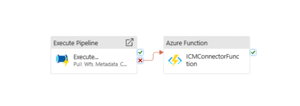
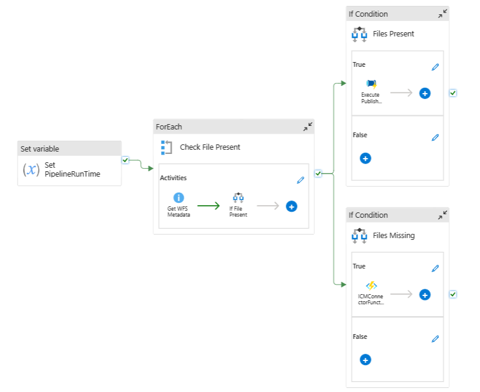
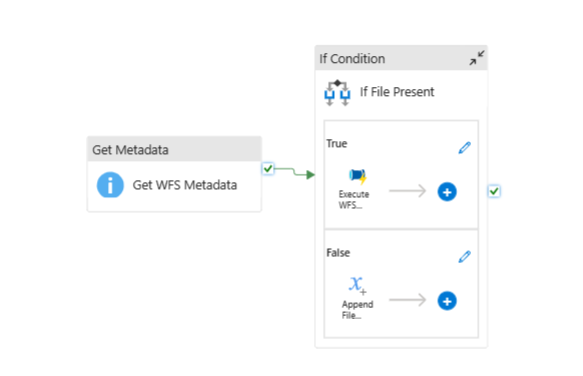
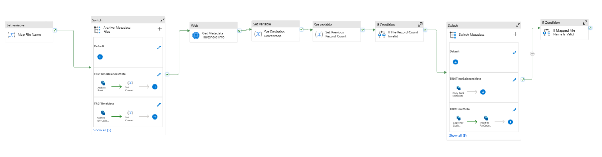

## Table of Contents 
1. [Overview](#overview)
2. [Prerequisites](#prerequisites)
3. [Architecture Overview](#architecture-overview)
4. [Data Flow](#data-flow)
5. [Data Targets and Impacts](#data-targets-and-impacts)
6. [Monitoring and Alerting](#monitoring-and-alerting)

## Overview

The Metadata pipelines perform the following:
- Processes and transfers metadata files from WFS SFTP location to Cartier Blob Storage.
- Updates Cartier Blob Storage with the latest file paths and handshake information, archives these files, and then deletes the original files from the source.
- Sends ICM alerts for any expected files that are not present, and notify engineers in case of any activity failure.

## Prerequisites

Before diving into the details of the metadata pipeline, ensure the following prerequisites are met:
- Azure Synapse Analytics Workspace: Ensure you have access to Cartier Azure Synapse workspace.
- Cartier Storage Account: Ensure you have access to the Cartier Azure Storage Account where the files will be stored.
- WFS SFTP Credentials (optional): Necessary credentials to access the WFS SFTP location from where the metadata files are sourced, this is mainly for debugging purposes where engineers have to manually drop the files into the SFTP location.

## Architecture Overview

The Metadata pipelines follow a sequential flow starting with `Pull_Wfs_Metadata_Parent`, and then `Pull_Wfs_Metadata_Child`, and `Pull_Wfs_Metadata_Inner_Child` pipelines.
The architectural design of these pipelines involves the transfer of metadata files from the WFS SFTP into Cartier Blob Storage.
The `Pull_Wfs_Metadata_Parent` pipeline is designed to expect four files from WFS SFTP location daily: BANK_policy_info_export.csv, PAY_CODE_policy_info_export.csv, TOR_ABSENCE_TYPE_policy_info_export.csv, and bank_balance_export.csv

**Pull_Wfs_Metadata_Parent:**
- This pipeline serves as the parent pipeline with the daily trigger at 11PM in Pacific Time.
- It orchestrates the execution of the child pipelines, `Pull_Wfs_Metadata_Child` and `Pull_Wfs_Metadata_Inner_Child`.
- It also has an activity, `ICMConnectorFunction`, that sends an alert in case any of the child pipeline or nested pipeline fails.

**Pull_Wfs_Metadata_Child:**
- This pipeline is executed by the `Pull_Wfs_Metadata_Parent` parent pipeline.
- It is responsible for checking the presence of all metadata files in the WFS SFTP location and process the files.
- It uses the `Check File Present` activity to iterate through a list of expected files.
- For each file, it uses the `Get WFS Metadata` activity to check if the file exists in the SFTP location.
- If the file is present, it triggers the `Execute WFS Metadata File` activity to call Pull_Wfs_Metadata_Inner_Child pipeline.
- If the file is missing, it appends the filename to the `MissingFiles` variable for alerting.

**Pull_Wfs_Metadata_Inner_Child:**
- This pipeline is executed by the `Pull_Wfs_Metadata_Child` parent pipeline for each metadata file.
- It handles the the main logic of data quality check, transfering each metadata file, including update file names and column names, and then append each file into Cartier blob storage locations. If the data quality for any file does not meet a certain threshold, that file will not process and engineer will be alert through Icm. If the file is PAY_CODE_policy_info_export, it has an addition step to copy file into `PayCodeMetadata` table for our usage.
- It then updates the latest file paths in `HRDLFilePublishDetails` table, then uses such file paths to generate the handshake files.
- After successfully executes the above steps, it archives the metadata file into `wfs-metadata-archive` blob, and then deletes them from the SFTP source to make sure that we get the latest files in the next run.

These Metadata pipelines validate metadata files presence, process the files, store them at Cartier Storage for later HRDL publishing. The parent pipeline orchestrates the execution of the child pipelines and handles error handling and notifications. The child pipelines are responsible for the logic of the metadata transfering process, at the end it triggers the HRDL publishing pipelines.


## Data Flow
The following diagram illustrates the data flow of the metadata pipelines:

1. Pull_Wfs_Metadata_Parent



2. Pull_Wfs_Metadata_Child




3. Pull_Wfs_Metadata_Inner_Child



Please refer to the actual Synapse workspace pipeline for more details.

## Data Targets and Impacts
The metadata pipelines have the following data targets:

**Data Targets (Sinks):**
- **Azure Cartier Blob Storage**: The destination for the metadata files is the Cartier blob storage located at https://strcartierdev.blob.core.windows.net (DEV) and https://strcartierppe.blob.core.windows.net (PPE). For each file, its historical data is located at "user/trusted-service-user/gold/TR01/<replaced with file names>/Full/"
- **HR Data Lake**: The final destination or the metadata files is at "HR Data Lake" https://strhrdldevproxy.dfs.core.windows.net. 
 . Sample of a file location: `publish/TR01/TR01ShiftRecords/Delta/202309142041/D_<fileName>_2023_09_14_20_41_32.snappy.parquet` 
 - [Metadata schema can be found here.](../tr01_schema.md)
- Handshake File Structure in Cartier Blob Storage:
```
user/trusted-service-user/gold/TR01/<Mapped File Name>
├── TR01TimeOffMeta
│   └── Full
│       ├── Handshake
│       ├── 202301020000
│       ├── 202301010000
│       └── ...
├── TR01TimeMeta
│   └── Full
│       ├── Handshake
│       ├── 202301020000
│       └── ...
├── TR01TimeBalancesMeta
│   └── Full
│       ├── Handshake
│       ├── 202301020000
│       └── ...
│...
 ```
 - `HRDLFilePublishDetails` Table Storage: For each metadata file, the pipeline updates the `LatestSourceDataPath` and `LatestHandshakePath` in this table to be used for generating the handshakes. 
    - Example of `LatestSourceDataPath` value: "user/trusted-service-user/gold/TR01/<replace with file name>/Full/202308312300/D_<replace with file name>_2023_08_31_23_00_00.snappy.parquet". 
    - Example of `LatestHandshakePath` value: "user/trusted-service-user/gold/TR01/<replace with file name>/Full/Handshake".
- `wfs-metadata-archive` Table Storage: The pipeline archives the metadata files into this table daily for data traceability. Here engineers will find the date and time when the file was archived in the file name.
- `PayCodeMetadata` Table: The pipeline updates the content of PAY_CODE_policy_info_export file daily for our own consumption.

**Data Formats:**
- Cartier Blob Storage: Files are stored in Parquet format - orignally files are in CSV format.
- `wfs-metadata-archive` Table Storage: Files are stored in CSV format.
- `HRDLFilePublishDetails` Table Storage: the values are stored as strings.

 **Pipeline Impacts:**
- HR DataLake Accessibility: Once stored in Azure Blob Storage, this metadata becomes accessible for other pipelines to pick up and continue the HR DataLake publihsing processes.
- Alerting and Monitoring: Data failures trigger ICM tickets, affecting monitoring result and incident response.

## Monitoring and Alerting
In the Metadata pipelines, which consisted of three pipelines `Pull_Wfs_Metadata_Parent`, `Pull_Wfs_Metadata_Child`, and `Pull_Wfs_Metadata_Inner_Child`, monitors and alerts are handled in the following ways:

**Monitors:** Engineer can check pipeline monitoring results in the Azure Synapse workspace under Monitor tab.

**Failures:** If any activity within the pipeline fails, it will be marked as a failure and subsequent activities that depend on it will not be executed. This ensures that the pipeline does not continue if there is a failure in any activity. An alert is then sent using the `ICMConnectorFunction` Azure Function activity. This function sends an alert message with details about the pipeline failure, including the pipeline name, run ID, and the specific activity that failed. The severity of the alert is set to "3".

**Alerts:** The `ICMConnectorFunction` activity inside the `Pull_Wfs_Metadata_Child` pipeline is triggered when there are missing metadata files. Its purpose is to send an alert to the ICM connector with the severity set to "4" with the missing file names.
