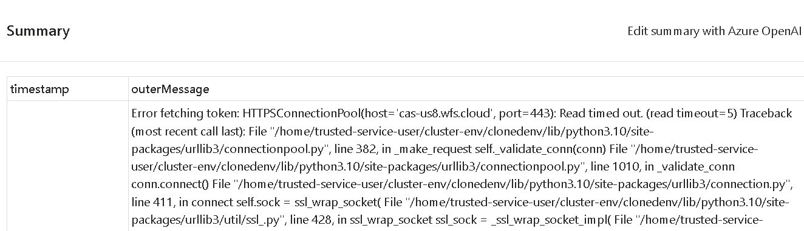
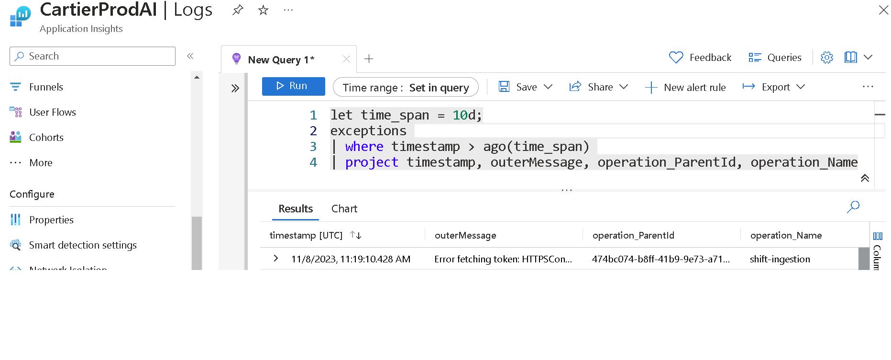
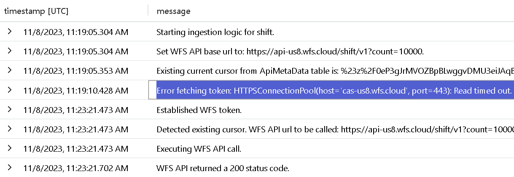

# Troubleshooting Guide: PySpark Notebooks

This guide will help you diagnose failures within the PySpark Notebooks which are executed via the Synapse Pipelines. There are 3 Notebooks leveraging the same monitoring / logging platform therefore following these steps will allow you to retrieve the pertinent data to diagnose an incident.
Remember that troubleshooting can sometimes be complex, and these steps might not cover every possible scenario. Use this guide as a starting point and adapt the steps based on your specific situation.


## List of known incidents

<details><summary><b>Transformation Notebook - Did not detect existing Silver_Temp_Parquet</b></summary>

1. **Symptoms** Sev 4 IcM ticket resulting from now existing Silver temp parquet. 

    - Here is an [example: Incident 428501776](https://portal.microsofticm.com/imp/v3/incidents/incident/428501776/summary).
    - Exception example: **Did not detect existing Silver_Temp_Parquet ApiDataLocation table value for calculated-time. This should only happen during initial run; if not initial run this is a valid error.**
    - Troubleshooting steps: review logs & ensure this was thrown during 1st ever run of pipeline.

2. **Mitigation**

    - Figure out if this is an initial/1st ever run or not.
    - If initial mitigate / resolve as this is expected.
    - If not initial investigation is needed.
      - Review ApiDataLocation table history to find when deletion took place or contact WFS-HRDL team to ask if a deployment / recent change removed this column value.
      - After diagnosis as to why this value was deleted WFS-HRDL engineer team will review how to properly mitigate incident.

</details>

<details><summary><b>Ingestion Notebook - 500 server error</b></summary>

1. **Symptoms** Sev 4 ticket resulting from WFS API returning 500.

    - Here is an [example: Incident 450422330](https://portal.microsofticm.com/imp/v3/incidents/incident/449669614/summary).
    - Exception example: **Exception occurred during ingestion logic: 500 Server Error: for url: https://api-us8.wfs.cloud/shift/v1** 
    - Troubleshooting steps: review the logs to diagnose at what point the issue took place & that following pipeline runs were successful.

2. **Mitigation**

    - 500 at ingestion layer has been seen during the WFS API call, verify this is the case, if not contact team as this a new detected issue.
    - Exception should have been thrown, leading to this notebook and the following, transformation & publishing, to not run for this data type. Following Pipeline run, in 30 minutes, will run and pick up any data that was missed during this run. If following Pipeline was successful we can mitigate incident as no costumer impact took place, if not immediately contact team and begin engagement with WFS support engineers as this can be a greater issue with the WFS API.

</details>

<details><summary><b>Ingestion Notebook - Error fetching token</b></summary>

1. **Symptoms** Sev 4 ticket resulting from a timed out API call when trying to get a credential token from the WFS API.

    - Here is an [example: Incident 450422330](https://portal.microsofticm.com/imp/v3/incidents/incident/450422330/summary).
    - Exception example: **Error fetching token: HTTPSConnectionPool(host='cas-us8.wfs.cloud', port=443)**
    - Troubleshooting steps: review the logs to verify built-in retry behavior was successful.

2. **Mitigation**

    - If retry was successful and notebook completed mitigate / resolve this incident as transient.
    - If retry was not successful verify if pipeline retry or following pipeline run were successful, if so mitigate this incident and contact to team to see why retry was not successful.
    - If no retries, built-in or following pipeline, we could have a credential issue or the WFS API might be down, immediately contact team and begin engagement with WFS support engineers.

</details>

<details><summary><b>Publishing Notebook - PathExistsException mssparkutils</b></summary>

1. **Symptoms** Sev 4 ticket resulting from Publishing notebook code running twice within the same Pipeline run. 

    - Here is an [example: Incident 445120402](https://portal.microsofticm.com/imp/v3/incidents/incident/445120402/summary).
    - Exception example: **An error occurred while calling z:mssparkutils.fs.mv.
: org.apache.hadoop.fs.PathExistsException: `gold/TR01/TR01ShiftRecords/Full/202311260245/_SUCCESS': File exists**
    - Troubleshooting steps: review the logs to diagnose at what point the issue took place & that following pipeline runs were successful.

1. **Mitigation**

    - This issue takes place when an unexpected product behavior takes place. Notebook code runs twice within the same execution.
    - Exception is do to system trying to create an already created publishing file, hence the PathExistsException.
    - Given that Notebook code runs once, successfully, files are published. Second run causes the error since we have already created these files. Therefore, there is not customer impact. 
    - Verify that following runs did not have issues and mitigate / resolve ticket as transient.

</details>

## Troubleshooting Steps

1. **Review IcM ticket**. Review the error / exception present in the ticket's summary.
    
2. **Review the known incidents section**. If incident is not known proceed.
3. **Get the exception logs from associated error**. Take note of the exception shown in the ticket's summary and review the exception's table within the [CartierProdAI Application Insights](https://ms.portal.azure.com/#@microsoft.onmicrosoft.com/resource/subscriptions/f8a339ea-4445-4d69-a4bb-b7c77c9db241/resourceGroups/RG-Cartier-Prod/providers/Microsoft.Insights/components/CartierProdAI/logs) service.
   1. To get to the table go to the service, find logs under the monitoring tab & find the exceptions table. Run the following query to pull the latest exceptions (adjust timestamp as needed).
    
  
        ```
        exceptions 
            | where timestamp > ago(1d)
            | project timestamp, outerMessage, operation_ParentId, operation_Name
        ```

4. **Get the correlation ids**. All logs are correlated via the following fields: operation_ParentId & operation_Name. Get these values from the associated exception logs and copy them.
5. **Get the trace logs from associated error**. With the operation_ParentId  & operation_Name pull all of the trace logs prior to the error which will give you an idea of where the error took place. Run the following query:

    ```
        exceptions 
        let time_span = 10d;
        let incident_parentId = '474bc074-b8ff-41b9-9e73-a71d60da1f78';
        let incident_notebook_name = "shift-ingestion";
        let ex = exceptions 
            | where timestamp > ago(time_span) 
            | where operation_ParentId ==  incident_parentId and operation_Name == incident_notebook_name
            | summarize arg_max(outerMessage, *) by timestamp
            | project timestamp, message = outerMessage, operation_Name, operation_ParentId;
        let traces = traces
            | where timestamp > ago(time_span) 
            | where operation_ParentId == incident_parentId and operation_Name == incident_notebook_name
            | summarize arg_max(message, *) by timestamp
            | project timestamp, message, operation_Name, operation_ParentId;
        union ex, traces
    ```
  
    
6. **Review notebook code & diagnose**. At this point you will have the notebook in which the error took place (operation_Name), the complete set of logs & the exception. Review the PySpark code associated with that notebook & try to pin-point an issue. If after verification nothing stands out please contact team for SME assistance.
   1. You can refer to the Notebook design documentation to gain an understanding of each notebook's responsibility:
      1. [Ingestion Notebook](../../design/pyspark_notebooks/api_ingestion_notebook.md)
      2. [Transformation Notebook](../../design/pyspark_notebooks/api_transformation_notebook.md)
      3. [Publishing Notebook](../../design/pyspark_notebooks/api_publishing_notebook.md)