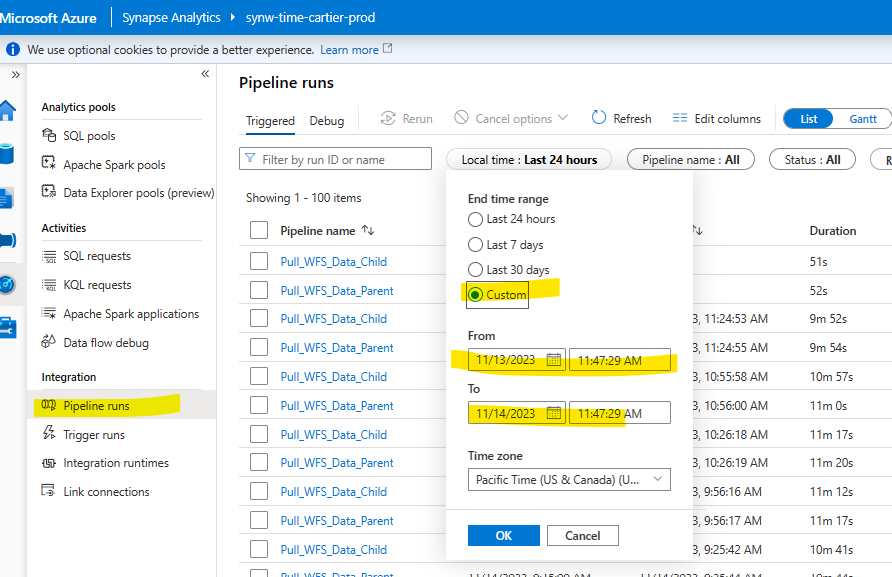

# Troubleshooting Guide for Known Issues Faced in Prod

**Please use this guide as a starting point and update the guide when new issue is founded.**
Remember that troubleshooting can sometimes be complex, and these steps might not cover every possible scenario. Use this guide as a starting point and adapt the steps based on your specific situation.

## Mitigation Guide For Known Issues

<b>HRDL Publish: Data Quality Exceptions</b>

- Symptoms: Sev 4 Icm ticket is generated and its content starts with _"Did not detect existing Silver_Temp_Parquet ApiDataLocation table value for calculated-time. This should only happen during initial run; if not initial run this is a valid error."_ . Here is an [example: Incident 428501776](https://portal.microsofticm.com/imp/v3/incidents/incident/428501776/summary).
    
- Troubleshooting steps: search for the pipeline failure in Synapse monitor by time range filer. This was a transient issue.
    
    
- Mitigation steps: 
    - Figure out if this is an initial run or not.
        a. if initial mitgate / resolve as this is expected.
    - If not initial investigation is needed.
    - Review ApiDataLocation table history to find deletion culprint.
    - Reach out to team to see if anyone was reviewing this table.
    - Replace the Silver_Temp_Parquet file location with the previous file before the deletion occurred, re-run the ingestion pipeline - which is **pull_wfs_datat_parent** pipeline - with cursors pointing lastCursor before file deletion & run the pipeline again.

<b>Error fetching token</b>

- Symptoms: Sev 4 Icm ticket is generated, with title _"Exceptions from CartierProdAI App Insights"_, and its content starts with _"Error fetching token: HTTPSConnectionPool(host='cas-us8.wfs.cloud', port=443): Read timed out."_ in Icm ticket. Here is an [example: Incident 437731770](https://portal.microsofticm.com/imp/v3/incidents/incident/437731770/summary)

- Troubleshooting steps: This alerts is generated from our Icm Automation monitor system, more details can be found [here](https://portal.microsofticm.com/imp/v5/automation/workflows). Engineer can also check the logs and traces in [CartierProdAI Application Insights](https://ms.portal.azure.com/#@microsoft.onmicrosoft.com/resource/subscriptions/f8a339ea-4445-4d69-a4bb-b7c77c9db241/resourceGroups/RG-Cartier-Prod/providers/Microsoft.Insights/components/CartierProdAI/logs). If more guidance needed, check [common notebook TSG](./notebooks_guide/notebooks_troubleshooting_guide.md) for more details. The failure is a transient issue caused by WFS token, and the pipeline automatically re-try with success. Contact WFS for more information about this failure. In this incident, Synapse was not able to initiate the execution of 'Ingestion' notebook as it couldnt create the run-time cluster in the underlying Spark pool. Here's the error: 'FAILED_CLUSTER_CREATION: Livy session has failed. Session state: Error. Error code: FAILED_CLUSTER_CREATION.'

- Mitigation steps: Since next run of the pipeline completed successfully, mitigated the ticket.

<b>Synapse Analytics pipeline failure:</b> Pull_WFS_Data_Parent in synw-time-cartier-prod identified a failure

- Symptoms: Sev 4 Icm ticket is generated and its content starts with _"Current pipeline Run ID: xxxxx. Failed child pipeline: Pull_WFS_Data_Child's run ID xxxxx. About this pipeline: This pipeline is scheduled to run every 30 minutes..."_ . Here is an [example: Incident 429953165](https://portal.microsofticm.com/imp/v3/incidents/incident/429953165/summary).

- Troubleshooting steps: search for the pipeline failure from the run id in Synapse monitor. Contact WFS for more information about the WFS API. The failure iwas a trainsient issue caused by the WFS API.

- Mitigation steps: The failure is a trainsient issue caused by the WFS API, and it was automatically successfully re-run after 30 minutes.

## Troubleshooting General Pipeline Failures:

**If you are encountering an issue that is not mentioned above, it is likely a new issue. While some potential issues have been documented, most are not yet resolved. Please refer to the steps below to troubleshoot the issue.**

#### Common troubleshooting steps for all pipelines

1. Follow the ICM instructions if there are any.
   - Read the exception message.
   - Get the pipeline name and run ID.

2. Go to Synapse workspace and find the pipeline that caused the failure.
   - Engineer can find the failed pipeline under Monitor -> Trigger runs, and then set the  filter to find the pipeline run ID or pipeline name.
   - Begin to trouble-shoot and debug the find the source of failure on the error message. It will usually point to the specific pipeline or activity that encountered the issue.
   - After finding the source of failure, which should happen at any activity in the pipeline, take the actions to address it.

 3. Mitigate issue.
    - Depending on the design of the pipeline, engineer can apply the appropriate mitiagation or recovering steps.

<b>TSG for Pull Pipelines</b>

1. Common troubleshooting steps for pull pipelines:
    - [Common troubleshooting steps for all pipelines](#common-troubleshooting-steps-for-all-pipelines) right above.
    - For mitigation or recovery steps: publish pipelines are 
2. [Pull pipelines TSG here](pipelines_guide\pull_pipelines\data\pull_wfs_data.md)

<b>TSG for Publish Pipelines</b>

1. Common troubleshooting steps for publish pipelines:
    - [Common troubleshooting steps for all pipelines](#common-troubleshooting-steps-for-all-pipelines) right above.
    - For mitigation or recovery steps: **pull pipelines** are triggered to run every 30 minutes so re-run is not needed. If there is a failure, engineer is expected to fix the issue and the next run will automatically happen. 
2. Pipeline [publish_hrdl_entities_parent](pipelines_guide\publish_pipelines\publish_hrdl_entities_parent.md)
3. Pipeline [publish_hrdl_full_data_parent](pipelines_guide\publish_pipelines\publish_hrdl_full_data_parent.md)
4. Pipeline [publish_hrdl_full_child](pipelines_guide\publish_pipelines\publish_hrdl_full_child.md)
5. Pipeline [publish_hrdl_delta_child](pipelines_guide\publish_pipelines\publish_hrdl_delta_child.md)
6. Pipeline [publish_hrdl_clean_up](pipelines_guide\publish_pipelines\publish_hrdl_clean_up.md)

<b>TSG for PySpark Notebooks</b>

1. Notebooks are executed by Pull pipelines. Failure at any notebook will lead to the failure of the pull pipeline execution.

1. [PySpark Notebooks TSG here](notebooks_guide\notebooks_troubleshooting_guide.md)

<b>TSG for Metadata Pipelines</b>

1. Common troubleshooting steps for metadata pipelines:
    - [Common troubleshooting steps for all pipelines](#common-troubleshooting-steps-for-all-pipelines) right above.
    - For mitigation or recovery steps: to re-run the **metadata pipelines**, engineer needs all four expected files to exist in the WFS SFTP location.

2. [Metadata pipeline TSG here](pipelines_guide\pull_pipelines\metadata\pull_wfs_metadata.md)

